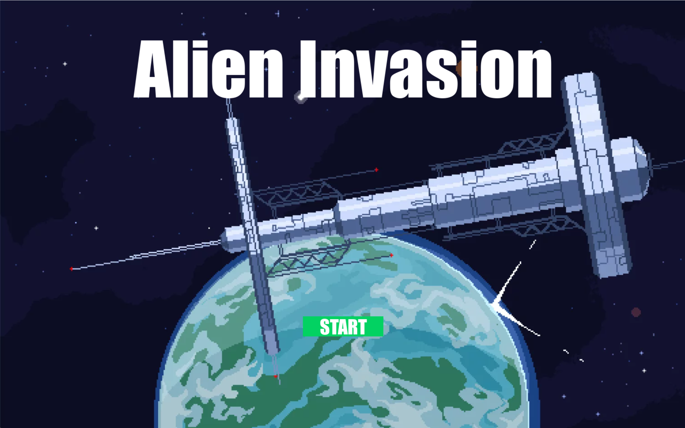
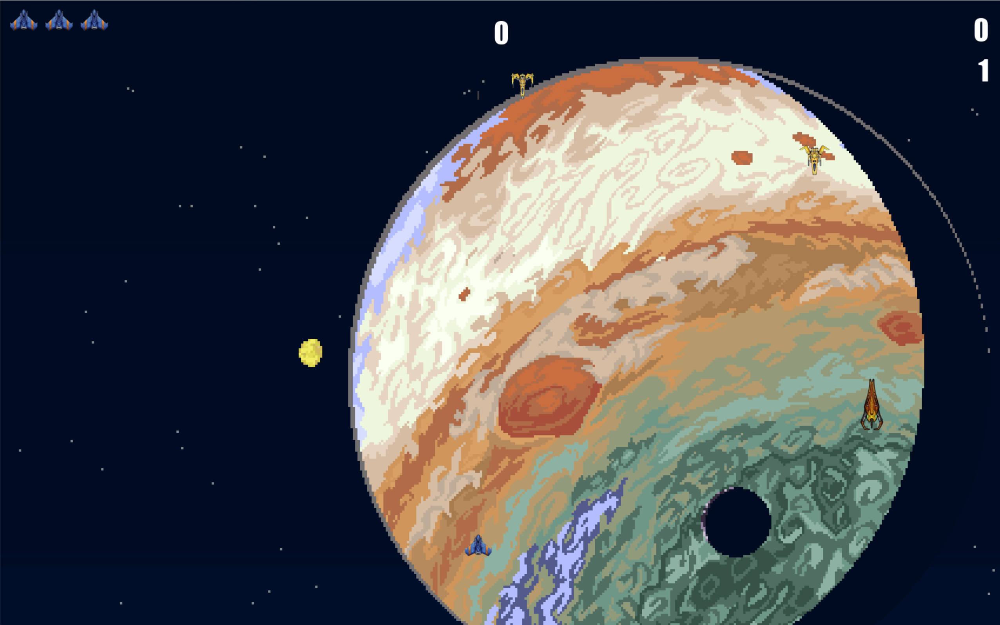

# Alien Invasion

基于 Python 和 Pygame 开发的经典 2D 射击游戏。
项目参考自《Python编程：从入门到实践》，并在原版基础上进行了优化。

## 游戏演示





## 主要功能

- **控制飞船**：自由移动，精准射击。
- **游戏难度**：随关卡增加上升。
- **记分系统**：包含实时得分和最高分记录。
- **优化体验**：丰富游戏玩法与界面。

## 环境依赖

安装 Python 3.x。

需要的第三方库：
- `pygame`

## 如何开始游戏

### 方式一：直接运行 (Windows .exe)
无需安装 Python 环境，下载即玩。
**[下载](https://github.com/Trainingdlu/Alien_Invasion/releases/latest)**

### 方式二：源码运行
如果你想查看源码或进行二次开发：

1. **克隆仓库**
   ```bash
   git clone https://github.com/Trainingdlu/Alien_Invasion.git
   ```

2. **安装依赖**
   ```bash
   pip install pygame
   ```

3. **运行游戏**
   ```bash
   python alien_invasion.py
   ```

## 文件结构
- `alien_invasion.py`: 游戏主入口
- `settings.py`: 所有游戏参数设置
- `ship.py` / `alien.py`: 飞船与外星人类定义
- `images/sounds`: 存放素材

## 致谢
- 原作者：[美] Eric Matthes
- 开发者：Trainingcqy

